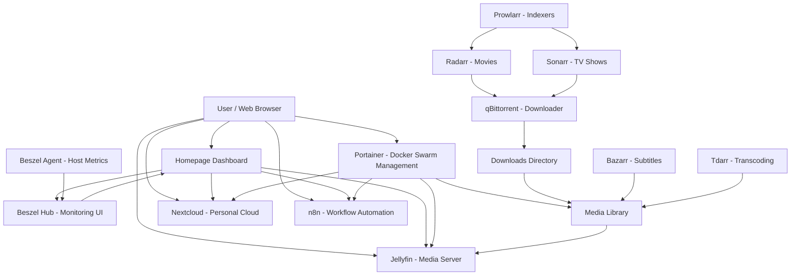

# Rod Ngo Server Docker Swarm + GitOps
## 🏗 System Architecture

The following section describes the overall architecture of this homelab, deployed on a single Docker Swarm node.

It includes:
- Media automation
- Media consumption
- Cloud services
- Automation
- Monitoring
- Management

